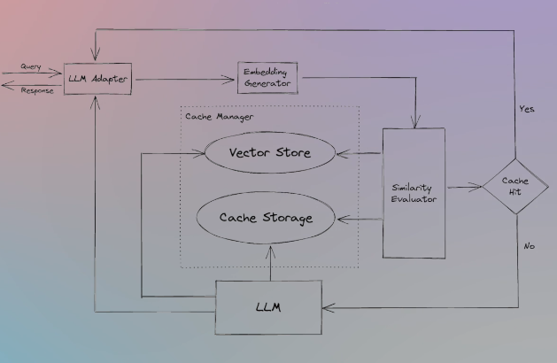
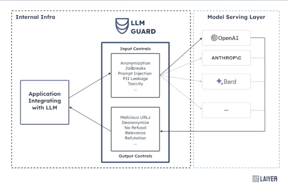

# 🚧 Challenges in Integrating Agents into Production Environments

---

## 1. ⏱️ Runtime

Agents often require **multiple LLM calls** to perform reasoning, make tool calls, process tool outputs, and then continue reasoning.  
This **sequential flow** increases latency.

### 🔧 Workarounds:
- ✅ **Semantic Cache**  
  
- ✅ **LLM Cache**

---

## 2. 📏 Context Window

Most LLMs today (as of **April 13, 2025**) support **up to 128k tokens**, but this can still be exhausted quickly due to:
- Prompt size
- History
- Intermediate reasoning
- Tool outputs

Some Gemini models offer **1M token** context windows, but sending that much data isn't ideal:
- **Garbage In = Garbage Out**
- LLMs often **forget the middle parts** of long context.

📖 Read more: [Lost in the Middle: How Language Models Use Long Contexts](http://arxiv.org/pdf/2307.03172)

---

## 3. 🧠 Hallucinations

LLMs are **probabilistic models**. So, when used as agents (with multiple calls), there's a higher chance of errors accumulating.

🧮 **Example**:  
If one LLM call has 90% accuracy (0.9), over 6 sequential steps:
> 0.9⁶ = **0.53 accuracy**

### 🛠 Solutions:
1. **RAG** – Ground the prompt with real context  
2. **Tool Selection** – Ensure the right tool is chosen by the agent

---

## 4. 🛠️ Fine-Tuning for Tool Use

You can **fine-tune an LLM** to better identify and use tools.

📖 Reference: [Gorilla: Large Language Model Connected with Massive APIs](https://arxiv.org/pdf/2305.15334)

> Fine-tuning improves the model’s ability to select the **right tool**, increasing the accuracy and efficiency of agents.

---

## 5. 💸 Pricing

Agent workflows involve:
- Long prompts
- Multiple LLM calls
- Tool responses  
Which leads to **high token usage** = **high cost** at scale.

### 🔧 Mitigation Techniques:
- ✅ **Semantic & LLM Caching**  
  

- ✅ **RAG for Tool Selection**  
  Use semantic search to **narrow down tools** before the agent selects the final tool.

---

## 6. ✅ Response Validation

You must validate LLM responses before:
- Making tool calls
- Triggering UI updates
- Passing results downstream

📦 Tools like **Pydantic** can help structure and validate outputs —  
but no fully robust solution exists **yet**.

---

## 7. 🔐 Security

Agentic systems allow:
- DB queries
- API calls
- Tool invocations

This opens up risks like:
- **Prompt Injection**
- **Jailbreaking**
- **Access leakage** (API keys, internal tools, etc.)

### ✅ Best Practices:
- **Least privilege access** for tools and agents  
- **Input filtering & guardrails** for prompts

🛡️ Tool:  
**LLM Guard**  

---

## 8. ⚖️ Avoid Overkill

> **Don't use agents unless necessary.**

If the task is:
- **Deterministic** → Use simple pipelines or direct prompts  
- **Undeterministic** → Use agents

Using agents for everything is **overengineering**.  
Always **evaluate the complexity** of the task before deciding.