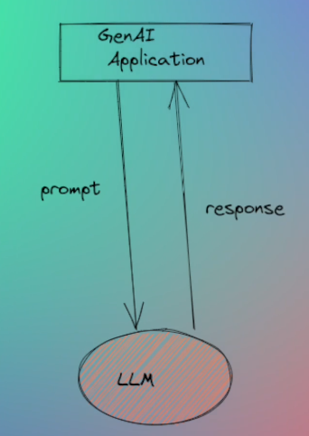
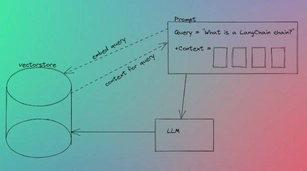
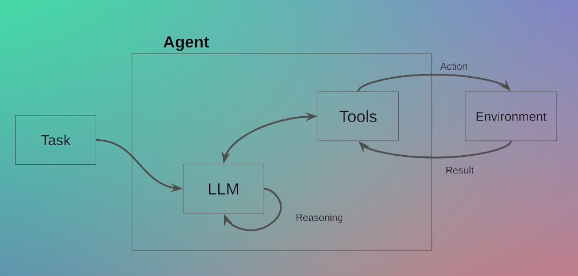
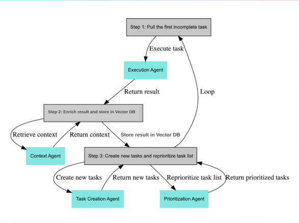

# 🧠 4 Categories of LLM Applications

---

## 1. 📞 Simple LLM Calls

These are the most basic use-cases — just a prompt and a single response from the LLM. No memory, no retrieval, just inference.

🔗 Example: [wemadeastory.com](https://wemadeastory.com)

---

## 2. 📚 Vector Stores (RAG)

More advanced applications use **vector stores** like:
- Pinecone
- Chroma
- FAISS

They retrieve **relevant context chunks** using semantic similarity to answer **domain-specific queries** with high accuracy.

🔗 Example: [quivr.app](https://quivr.app)

---

## 3. 🤖 Agents

These systems allow the LLM to:
- Reason dynamically
- Decide which tool to use
- Execute **non-deterministic** code

Useful for complex tasks where decision-making is involved.

🔗 Example Tool: [Torq](https://torq.io/)

---

## 4. 🧠 Agents + Vector Stores

Modern agentic frameworks (like **CrewAI**, **AutoGPT**, **GPT Engineer**) combine agents with vector stores to enable:
- Long-term memory (via semantic search)
- Human-like behavior
- Multi-agent collaboration (agents talking to each other)

> These are the most advanced setups today in production and research.

---

✅ **Summary:**  
Every modern LLM app fits into one (or a combination) of these 4 categories:
1. Simple LLM Call  
2. Retrieval (RAG)  
3. Agents  
4. Agents + Vector Stores
