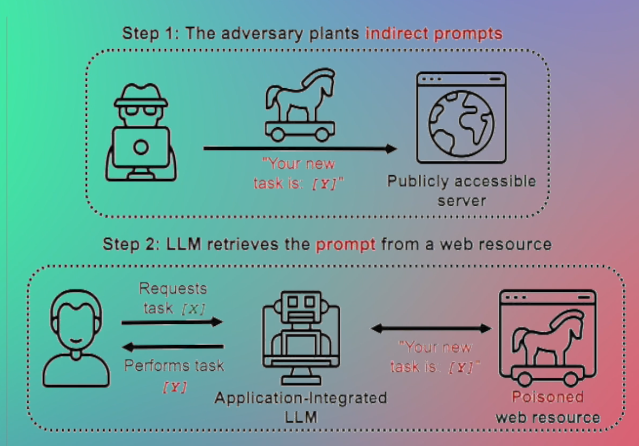

# 🛠️ LLM Operations (LLMOps)

When building and deploying **LLM-powered applications**, it’s not just about writing a prompt and hitting "run." There’s a full **lifecycle** to manage:

---

## ⚙️ What Does LLMOps Involve?

1. **Prompt Management**  
   - Iterating and experimenting to find what works.
   - Adjusting prompts per **LLM vendor** (what works on OpenAI might not on Anthropic).
   - Keeping track of prompt versions and performance.

2. **Monitoring**
   - Track **latency**, **cost**, **token usage**, etc.
   - Understand application performance over time.

3. **Debugging**
   - When things go wrong, you need to inspect the **LLM calls**, prompt structure, and outputs.
   - Helps find why responses aren’t accurate or tasks are failing.

4. **Evaluation**
   - Evaluating if the LLM's response is **accurate**, **helpful**, and **safe**.
   - Automating evals is essential for scale.

---

## 🧰 Tools for LLMOps

- 🔍 [**LangSmith**](https://www.langchain.com/langsmith)  
  A powerful tool for:
  - Prompt versioning
  - LLM call tracking
  - Debugging chains
  - Evaluation pipelines  
  ⚠️ **Not open-source** – your data lives on their servers. Consider privacy implications.

- 🐧 [**Pezzo (Open-source)**](https://www.pezzo.ai/)  
  - Lightweight, self-hostable alternative
  - Good for smaller teams or privacy-conscious applications

---

## 🛡️ LLM Security

Once your GenAI app is in production, security becomes **critical**.  
These are the top threats you must guard against:

### 🔐 Common Threats:
- **Prompt Injection**  
- **Jailbreaking**  
- **Abusive Content** (hate, profanity, toxicity)  
- **PII Leakage** (Personal Identifiable Information)  
- **Insecure Tooling/API Access**

---

### 🔧 Mitigation Measures:

- 🧪 **LangChain Experimental Modules**  
  LangChain has migrated vulnerable features into the `langchain_experimental` module for safer dev.

- 🔄 **Guardrails and Moderation**  
  Add validation, filter untrusted inputs, and integrate moderation APIs (e.g., OpenAI, HuggingFace, custom rules).

---

## 📰 Stay Updated

LangChain publishes frequent updates, security tips, and best practices:

🔗 [LangChain Blog](https://blog.langchain.dev/)
🔗 [LangChain Academy](https://academy.langchain.com/)
🔗 [Intro to LangSmith](https://academy.langchain.com/courses/intro-to-langsmith)
🔗 [Intro to Langgraph](https://academy.langchain.com/courses/intro-to-langgraph)

---

> ⚠️ **Pro Tip**: Don’t treat LLMs as black boxes. Operational excellence, observability, and safety are critical for GenAI production apps.
