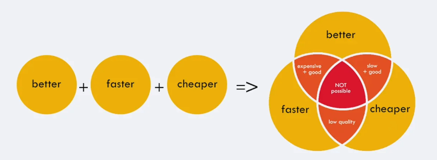

Here's your cleaned-up and structured **Markdown version** for the section on choosing between **Open-Source vs Managed Proprietary LLMs**, complete with headings, spacing, and visuals maintained:

---

# 🤖 Choosing Between Open-Source LLMs vs Managed Proprietary LLMs

There’s **no one-size-fits-all** when it comes to picking the right LLM. It heavily depends on:

- 📌 Your use case  
- 🏛️ Organizational policies  
- 💰 Budget  
- 🔐 Privacy and compliance requirements  

---

## 🏢 Using Open-Source Models in Production

**Main Advantage:**  
✅ **Full control & privacy** – Data never leaves your infrastructure.  
Ideal for sensitive industries like:
- 🏦 Banking  
- 🏥 Healthcare  
- 🔐 Government  

**Challenges:**
- Though the model itself is free, deploying it **at scale** is complex.
- You need to manage:
  - **Scalability**
  - **Availability**
  - **Reliability**
  - **Security**
- This operational cost often **exceeds** that of managed LLMs.

---

### ☁️ Hosted Open-Source Models (e.g., Groq)

- These services offer **hosted OSS models**, reducing infra complexity.
- But ⚠️ pricing often ends up **similar to proprietary LLMs**, defeating the cost-saving goal and the privacy and compliance concerns.

---

## 📉 Trend: First-Party vs OSS Models

Open-source adoption is increasing, but first-party models still dominate in enterprise-grade deployments.

---

## 🧪 Fine-Tuning

- You can **finetune both** proprietary and open-source models.
- OSS models often **outperform** general-purpose proprietary models when fine-tuned for a specific domain.

---

## ✅ Benefits of Managed Proprietary LLMs

1. 🔌 Plug and Play  
2. 💡 Reliable and Highly Available  
3. 👨‍💻 Vendor Support  
4. ✅ Compliance & Certifications  
5. 🏆 Consistently High-Quality Outputs  

---

## ✅ Benefits of Open-Source LLMs

1. 🔐 Full Data Privacy  
2. 🎯 Finetuning – allows deep domain-specific performance  
3. ⚙️ Flexibility in infrastructure & customization  
4. 💸 Potential cost savings (in smaller scale or private infra setups)

---

> 🧠 Choose based on **your organization's needs**, not hype. OSS is great for control, Managed LLMs are great for ease. There's room for **hybrid setups** too!