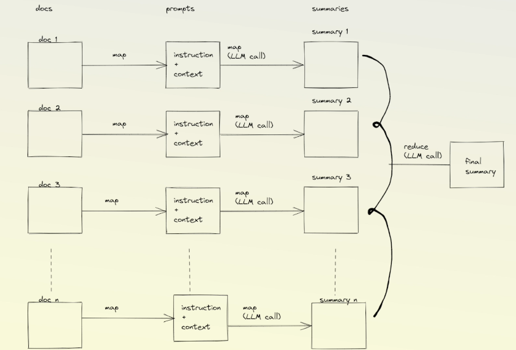
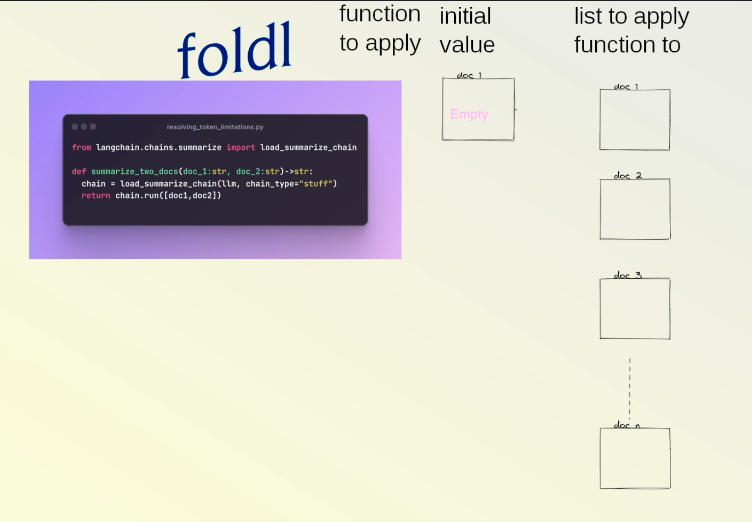
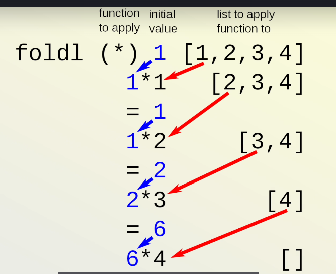

# Understanding Token Limitations in LLMs and Handling Them with LangChain

Every Large Language Model (LLM) has a **token limit**, often referred to as its **context length**. For example:

- **GPT-4o mini**: 128k tokens  
- **Gemini**: Up to 1 million tokens  

These limits are gradually increasing as GPUs become cheaper and models become more efficient.

---

## 🧠 What is Context Length?

LLMs operate in **tokens**, not words. A token could be:

- A part of a word (e.g., "ing")
- A full word
- Multiple words  

Each LLM uses a **tokenizer**, customized during training, to split input text into tokens. This tokenizer is optimized for the model’s purpose and can differ across models.

### 🔍 Tokenizer Examples

1. **Claude 3.5** (Anthropic):  
   Optimized for code, avoids splitting key elements like `def`, `()`, `{}` to preserve context.

2. **GPT Models (e.g., GPT-4)**:  
   Use **Byte Pair Encoding (BPE)**, balancing efficiency across code, conversation, and prose.

3. **Google Gemini**:  
   Likely optimized for multilingual text.

> 🧠 **Important**: Token limits apply to both input and output combined. If this combined size exceeds the context limit, the model may truncate parts of the input or response without throwing an error, leading to incomplete or inaccurate answers.

---

## ⚙️ How LangChain Helps Handle Token Limits

LangChain provides various summarization chains to help work within token limits, especially when handling large documents. The main strategies are:

1. **Stuffing**
2. **Map-Reduce**
3. **Refine**

---

### 1. 📦 Stuffing

All documents are directly “stuffed” into a single prompt and passed to the LLM.

```python
from langchain.chains.summarize import load_summarize_chain
from langchain.schema import Document

docs = [Document(page_content=t) for t in texts[:3]]
chain = load_summarize_chain(llm, chain_type="stuff")
chain.run(docs)
```

#### ✅ Pros:
- Simple and fast
- Only one LLM call

#### ❌ Cons:
- Not scalable
- Fails if the input exceeds the context limit
- Unsuitable for agent workflows or long documents

---

### 2. 🗂 Map-Reduce

Each document is summarized individually first, then all summaries are merged into a final summary.



```python
chain = load_summarize_chain(llm, chain_type="map_reduce")
```

#### ✅ Pros:
- Scales to large document sets
- Can run in parallel (faster for large inputs)

#### ❌ Cons:
- Higher cost (multiple LLM calls)
- Risk of information loss during the reduction phase

---

### 3. 🔁 Refine

The **Refine** strategy is best understood using the concept of `foldl` (fold-left) from functional programming — not for what it *does* (like multiplying), but for **how it processes** data step-by-step.



#### 🧪 `foldl` Analogy:

In functional programming, `foldl` processes a list by:
1. Starting with an **initial value** (e.g., `""` or `1`)
2. Taking the first item in the list and combining it with the current value using a custom function.
3. Repeating this for every item, one at a time, until the list is done.
4. The final accumulated value is the result.

#### 💡 Now think about it for summarization:

You want to summarize a series of documents, but instead of doing it all at once (like in `stuff` or `map_reduce`), you **build up** the summary **progressively** — one document at a time.

So:

- **Initial value**: an empty summary (`""`)
- **Each document**: the next item in the list
- **Function**: combine the current summary with the next document and generate a new refined summary



This is exactly what LangChain’s `refine` chain does.

#### 📄 How it works in practice:

```python
from langchain.chains.summarize import load_summarize_chain

chain = load_summarize_chain(llm, chain_type="refine")
```

#### ✅ Pros:
- Maintains continuity and context
- Useful for large documents with interrelated sections

#### ❌ Cons:
- Slower due to sequential processing
- Final summary may still grow large if not managed carefully

---

## 📊 Summary Table

| Chain Type   | Best For             | Pros                                 | Cons                                 |
|--------------|----------------------|--------------------------------------|--------------------------------------|
| **Stuff**     | Small inputs         | Simple, fast, one LLM call           | Fails with large inputs              |
| **Map-Reduce**| Many documents       | Scalable, parallel processing        | Costly, may lose detail              |
| **Refine**    | Contextual documents | Retains flow, context-aware summary  | Slower, more sequential              |

---