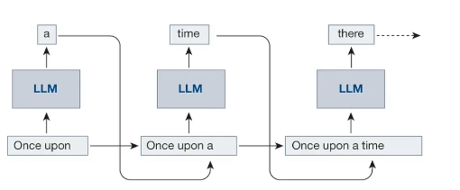
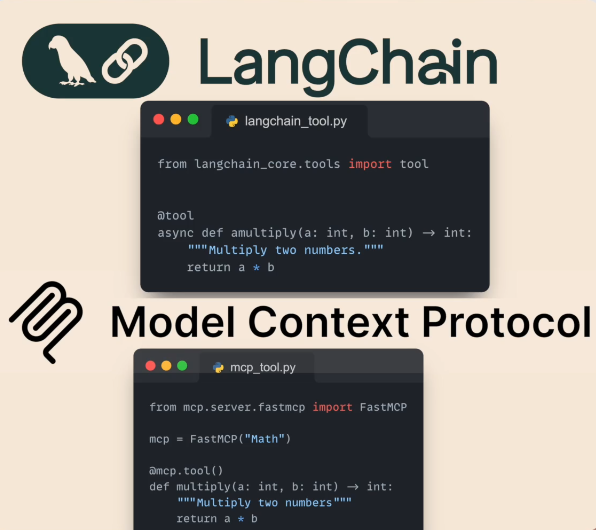
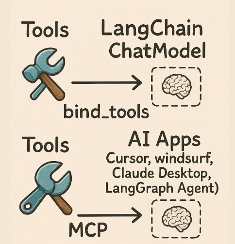
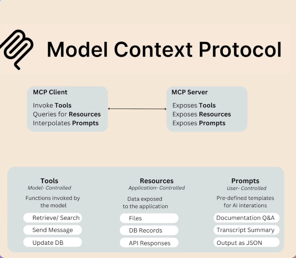

LLMs are statistical creatures, they predict next token in a sequential manner based on the probability distribution. 

Agents for which the LLMs act as a reasoning engine also do the same. So, let's take an example of this, if we ask what is the weather in Hyderabad? It's not going to hallucinate and give an answer since it doesn't have realtime information. It's going to do a tool calling, called get_weather("city"="hyderabad") with the function name and the arguments (So, the underlying llm would first generate this function name along with the arguments it takes to get the response). Now, the implementation comes done by software engineers or vendors or people managing the applications, who are going to take the function name, arguments and execute them and pass them to the llm again for generating next set of words which would be the answer for thr original question.

So, this tool calling can also be done through MCP

Let's understand the difference between Langchain and MCP:
Both lanchain and mcp has tools, tools are simply functions written by developers externally. So, they are like functions with arguments that are written according to your use case. And when we define tools, both in mcp and langchain we need to specify what is the funciton, what are the arguments that this function takes, when to use this function and also what it returns.

So, here the description is very very important because this is eventually used by the llm whether by the model or the mcp. So, in langchain these tools are called by the LLM itself in langchain using bind_tools function. But in MCP, the tools are handled by the AI Applications like Cursor, Windsurf, Claude Desktop, Langgraph Agent, etc. 

Both via mcp or langchain bind_tools we are passing into the llm's prompt the descripiton of the tools - when to invoke them, what arguments will they recieve, what output do they output. it basivally is an interface for the ai models to itneract with external tools.

Let's see differences:
MCP Takes this idea and generalizes it a bit, we not only expose tools with mcp, we also expose resources and it can also expose prompts and another difference is who we are going to expose this to,  so in langchain when we use the bind_tools we are binding the tools to the llm, but in mcp we are bidnign the tool to the ai application like cursor, windsurf which have under the hood has the llm, so the client is what injecting the tools description to the llm, We are not injecting directly, we have a couple of abstraction layers efore its getting injected. We have MCP Server which communciates with the list of tools to the MCP Client and the MCP Client is going to inject the instructions of the tools we need to invoke into the llm in the applcation.

Let's discuss about langchain mcp adapter
It is an open soruce, which enables seamless integration of mcp tools with langchain and langgraph. It has tool compatibiltiy so we can convert mcp tools into langchain and langgrapha gent compatible tools, so this allows develoeprs to leverage exisitng mcp servers that somebody else wrote without any manual adaption. IT will also supploes us with a mcp client which allwos us to connect with multiple mco servers whcih allows jus to use their tools.

