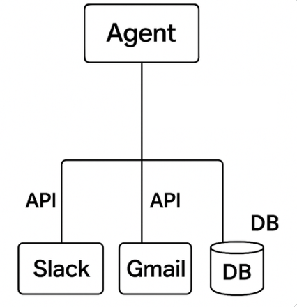
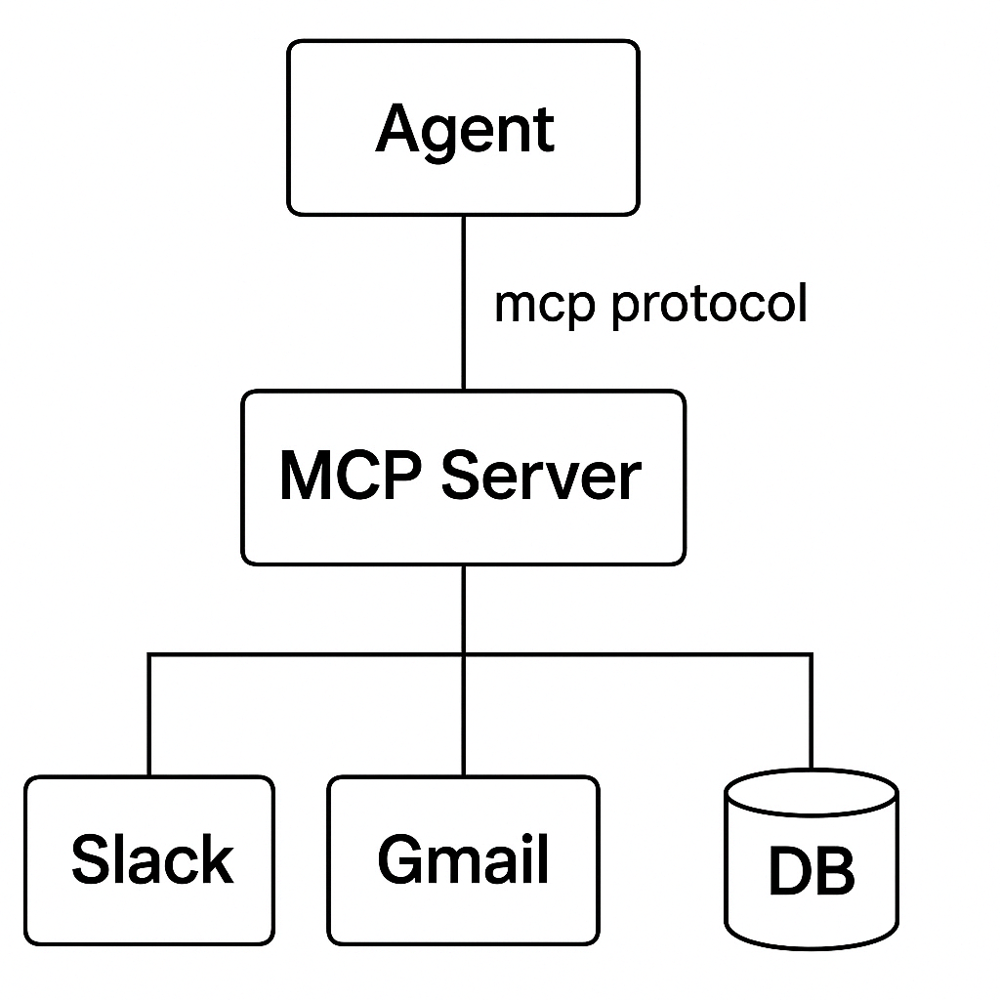

# Model Context Protocol

Why do we need MCP?

So, consider this above image where you implement an agent with the following integrations: Slack, Gmail and an External DB. Now, this is a custom implementation where you have understood the api's of each provider and how to connect to the database programmatically and then you find which endpoints are of use to your agent (let's say you want subject of each email, channels in slack etc) and then you write custom code for each api endpoint and implement it and attach to your agent. and this works perfectly. Your agent is trying to solve whatever your task is with the help of the tools attached. 

Now, some other person comes sees this agent and he also has the need for the same apis but a different use case where he need to extract labels, so he has to take this agent and then again understand all the APIs again and then write the custom code similar for the endpoints that are useful to him. This means that whoever that wants to use your agent would have to create a custom code for their use case similar to how you have implemented this.

Now, what if there is a standardized way for your agent to interact with any external system. That is called Model Context Protocol and 
this arises from a core principle in computer science and software systems that if you want to sovle a provlem you simply need to add another layer of abstraction: [Fundamental Theorom of Software Engineering](https://en.wikipedia.org/wiki/Fundamental_theorem_of_software_engineering)

This is exactly what MCP is going to do.

So, what happens in MCP is that we are going to integrate our agent with compatibility to the MCP Server and other agents that follow this compatibility with the MCP Protocol, then this would be universally used. This is like social media, only if few people are using it then it doesn't add any value but if millions are using and generating user content then it would really create value for all the users.