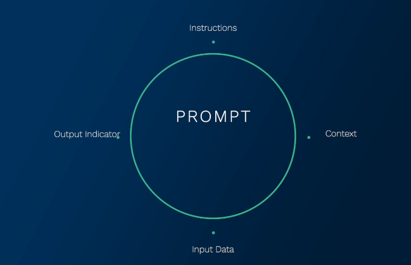
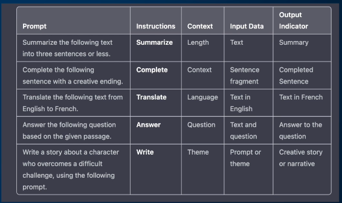

# 📦 Composition of a Prompt

Here is the formal terminology around prompts to make collaboration and communication smoother.

---

## 🤔 What’s a Prompt?

A **prompt** is the input we give to an AI model in order to receive a desired output.  
To better understand and structure prompts, we can break them down into **four key components**:

---

### 1. 🧭 Instruction  
The **heart of the prompt** — it tells the AI what task it needs to perform.  
Examples:  
- Summarize this article  
- Translate this sentence  

---

### 2. 🧠 Context  
Provides **additional background information** to help the model understand the task more accurately.  
- Not always necessary  
- Useful for improving relevance and accuracy

---

### 3. 📥 Input Data  
This is the **actual content** that the AI model processes to complete the task.  
- Could be text, code, documents, or any structured/unstructured data

---

### 4. 📤 Output Indicator  
Signals the AI **how** the output should be delivered.  
Examples:  
- “Give me the answer in bullet points.”  
- “Respond in JSON format.”

---

---

By understanding these components, we can write clearer, more effective prompts — which means better results from our AI models.

