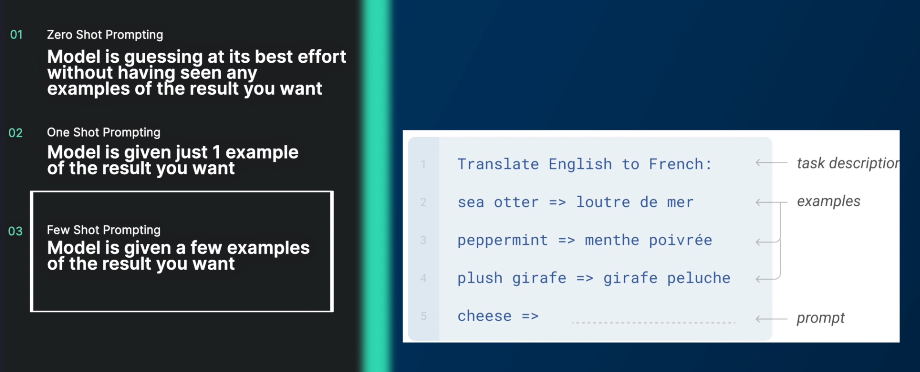
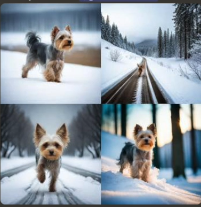
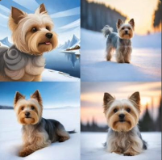
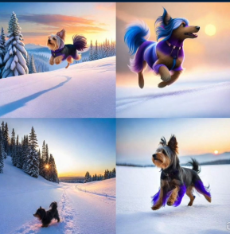

# Few SHot promptong

It works by providing an AI Model with a small number of exmapes or shots of a prariclar task or concept along withg insteuctions in the prompt. So, the model then uses these dxampels to geenrate or calssify jew data tha is simlar to the exmaples provided.

They are particulary useful in scenarios where htere is limited data a vaialbe for a given task sich as new langa8gae of doman wheee the daya maube scarce and they are useful for qujickpy adapting models to neew tasks or domains as rthey can eb used to finetunig exieting omdel swihtout requriign a larhe amount of new data

In Few shot prompotign, we have one shot where one exmaoke is given and a few shot is where we give the promtp a few examples. So, oneshot is subset of few shot prompting.

Elabnorat example demosntraign zero, one and few shot promptign.

Let;s compare the outpits for all of them.

the flow we are going to follwo in this exmaple is: 
We are going to do 0/1/ Few shot promtps to chat gpt to -> Generate image description prompts -> [Blue willow](bluewillow.ai) -> Generates an image 

We are going to compare all types of prompt and otuputs.

Zero shot Prompting:
Prompt: Write an Image Description with adjectives and nouns of a Yorkshire dog running in a winter landscape in Brazil
Response: A fluffy Yorkshire dog with silky, golden-brown fur dashes energetically through a serene winter landscape in Brazil. Its tiny paws kick up soft, white snow as it runs joyfully across a frost-covered meadow. Surrounding the lively pup are tall, leafless trees with delicate icicles hanging from their slender branches. A pale blue sky stretches above, casting a cool, crisp light over the sparkling snow and the dog’s glossy coat. In the distance, low hills blanketed in misty frost complete the peaceful, chilly scenery.

Image: 
Here, this is a  zero shot prompt ebcause we didnt provide any exmaples and the llm is simply now guessing and doing its best to procide us with an output that we would like.

Oen Shot prompting:
Prompt: 
Write a compressed perfect image description with adjectives and nouns of a Yorkshire dog runnhg in a winter landscape in Brazil:
Blue dog, shimmering, snow, trees, frosted, ice, movements

Write a compressed perfect irnage description with adjectives and nouns of a Yorkshire dog runnhg in a winter landscape in Brazil:

Response: 
Exuberant Yorkshire terrier, chocolate-golden fur, frost-laden Brazilian landscape, glistening white snow, agile legs, icy crystals, sparkling eyes, twinkling frost, serene wintry scene.

Here, we are getting a compression version and we are getting a much 

Few Shot Prompting:
Prompt: Write a compressed perfect image description with adjectives and nouns Of a Yorkshire dog running in a winter landscape in Brazil.
Examples of nouns and adjectives to use:
Blue dog, shimmering, snow, trees, frosted, ice

Write a compressed perfect image description with adjectives and nouns Of a Yorkshire dog running in a winter landscape in Brazil.
Examples of nouns and adjectives to use:
Red dog, Sweating, snow, flowers, frosted, ice

Write a compressed perfect image description with adjectives and nouns Of a Yorkshire dog running in a winter landscape in Brazil.
Examples of nouns and adjectives to use:
Green dog, Crying, Snow, bees, frosted, ice

Now you try writing the image description while genrating your own nouns and adjectives
- plug them in into a full description sentence.
Response:
A playful blue Yorkshire dog darts through shimmering snow, surrounded by frosted trees and glistening ice.
A spirited red Yorkshire dog bounds energetically amid snow-covered flowers, sweating lightly while navigating the frosted ice.
A whimsical green Yorkshire dog races snowdrifts, tears streaming down its face, as bees buzz around the icy, frosted landscape.
A vivacious violet Yorkshire dog leaps gracefully across the sparkling snow, its fur fluttering like a majestic flag, while the scent of pine fills the crisp, frosty air.

