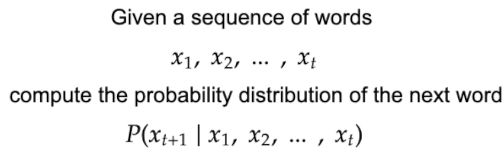

# What is a Language Model?

A **language model** is a *probability distribution over a sequence of words* — essentially, it predicts the likelihood of the next word given the previous ones.  
> _Definition from Wikipedia_

---

## 📈 Understanding It with an Example

Imagine the sentence:

> **"LangChain is a __________"**

Now, let’s fill in that blank. Some possible candidates might be:

1. Framework  
2. Library  
3. Banana  
4. Fruit

A language model assigns probabilities to each possible next word. For example:

- **Framework**: 0.99  
- **Library**: 0.80  
- **Banana**: 0.10  
- **Fruit**: 0.10  

Since **"Framework"** has the highest probability, the model chooses that as the next word. This is how language models work — predicting the most likely next token based on the given context.

---

## 🧮 Mathematically Speaking

A language model estimates:

```
P(xₜ₊₁ | xₜ, xₜ₋₁, ..., x₁)
```

Where `xₜ₊₁` is the next word, and `V` is the vocabulary of all possible words.  


---

## 💡 Everyday Applications

Language models power the autocomplete suggestions you see in:

- Gmail
- Text messages
- Google Search

They're constantly calculating the most probable next word — just like your phone's predictive typing!

---

## 🤖 What About Large Language Models (LLMs)?

A **Large Language Model (LLM)** is simply a language model trained on massive datasets — books, websites, code, conversations, etc. Because of this large training data, LLMs:

- Are better at understanding context
- Make more accurate next-word predictions
- Can complete entire thoughts, paragraphs, or even generate code

However, since they **only predict what comes next**, LLMs can sometimes **hallucinate** — i.e., generate plausible-sounding but incorrect information.

---

## ✅ TL;DR

- Language models predict the next word based on probability.
- LLMs do the same, but better, thanks to massive training data.
- They’re behind features like autocomplete and chatbots.
- Sometimes, they guess wrong — that’s a hallucination!

---