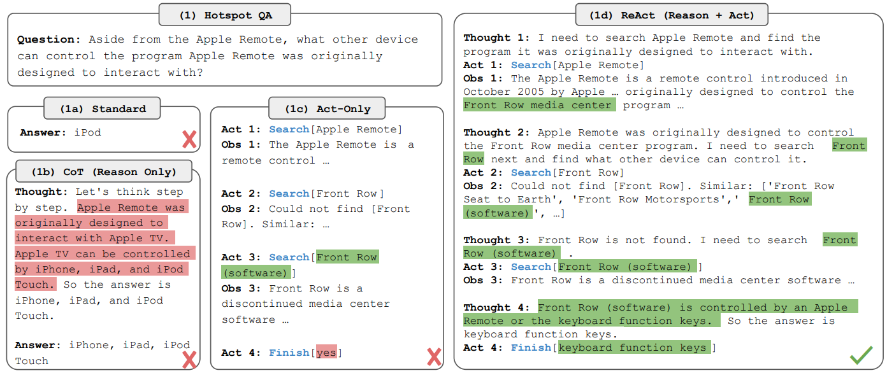
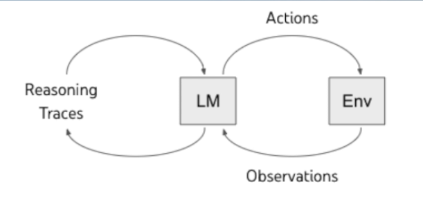

# 🧠 Reasoning and Acting (ReAct)

When we, as humans, are faced with complex tasks, we naturally **reason**, break the task down into smaller steps, **act** on them one by one, and ultimately complete the task.

Similarly, **Large Language Models (LLMs)** can also do this using a paradigm called **ReAct**.  
ReAct enables **dynamic reasoning and interaction** with external environments — making LLMs capable of performing **complex tasks** more effectively.

---

## 🔬 What is ReAct?

**ReAct** is a framework that integrates:
- 🤔 **Reasoning**: Step-by-step logic and decision-making  
- 🛠️ **Acting**: Interacting with tools, APIs, or environments to gather additional information or take action

> 📄 [Read the ReAct paper](https://arxiv.org/pdf/2210.03629) to dive deeper.

---

## 🧪 Comparison Example

Below is an example comparing how the task is handled in each method:

1. **Standard Prompting** – No reasoning, no action  
2. **Reason-only** – Uses logic but doesn’t interact  
3. **Act-only** – Interacts with tools, but no step-by-step reasoning  
4. **ReAct** – Combines both reasoning and acting



---

## ⚙️ ReAct = CoT + Tools

You can think of **ReAct** as:

```
ReAct = Chain of Thought (Reasoning) + Tool Use (Actions)
```

This combo makes the model much better at tasks requiring external data or multi-step logic.


